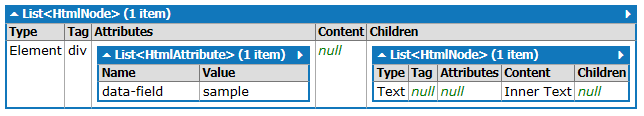
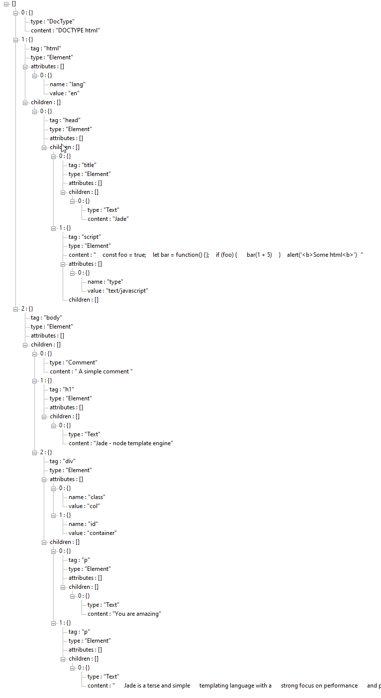

# Simple HTML parser

Convert html string into a simple object[]. Handles real world html.


``` cs
Install-Package NMyVision.HtmlParser
```

## Simple Example
```c#
var source = "<div data-field='sample'>Inner Text</div>";
var parser = new Parser(source);

parser.Parse();
```

returns this object.




## Advance Example
```html
<!DOCTYPE html>
<html lang="en">

<head>
  <title>Jade</title>
  <script type="text/javascript">
    const foo = true;
    let bar = function() {};
    if (foo) {
      bar(1 + 5)
    }
  </script>
</head>

<body>
  <h1>Jade - node template engine</h1>
  <div class="col" id="container">
    <p>You are amazing</p>
    <p>
      Jade is a terse and simple
      templating language with a
      strong focus on performance
      and powerful features.
    </p>
  </div>
</body>

</html>
```

To

]

```json
[
  {
    "type": "DocType",
    "content": "DOCTYPE html"
  },
  {
    "tag": "html",
    "type": "Element",
    "attributes": [
      {
        "name": "lang",
        "value": "en"
      }
    ],
    "children": [
      {
        "tag": "head",
        "type": "Element",
        "attributes": [],
        "children": [
          {
            "tag": "title",
            "type": "Element",
            "attributes": [],
            "children": [
              {
                "type": "Text",
                "content": "Jade"
              }
            ]
          },
          {
            "tag": "script",
            "type": "Element",
            "content": "\r\n    const foo = true;\r\n    let bar = function() {};\r\n    if (foo) {\r\n      bar(1 + 5)\r\n    }\r\n    alert('<b>Some html<b>')\r\n  ",
            "attributes": [
              {
                "name": "type",
                "value": "text/javascript"
              }
            ],
            "children": []
          }
        ]
      }
    ]
  },
  {
    "tag": "body",
    "type": "Element",
    "attributes": [],
    "children": [
      {
        "type": "Comment",
        "content": " A simple comment "
      },
      {
        "tag": "h1",
        "type": "Element",
        "attributes": [],
        "children": [
          {
            "type": "Text",
            "content": "Jade - node template engine"
          }
        ]
      },
      {
        "tag": "div",
        "type": "Element",
        "attributes": [
          {
            "name": "class",
            "value": "col"
          },
          {
            "name": "id",
            "value": "container"
          }
        ],
        "children": [
          {
            "tag": "p",
            "type": "Element",
            "attributes": [],
            "children": [
              {
                "type": "Text",
                "content": "You are amazing"
              }
            ]
          },
          {
            "tag": "p",
            "type": "Element",
            "attributes": [],
            "children": [
              {
                "type": "Text",
                "content": "\r\n      Jade is a terse and simple\r\n      templating language with a\r\n      strong focus on performance\r\n      and powerful features.\r\n    "
              }
            ]
          }
        ]
      }
    ]
  }
]
```


## Releases

1.0.8
- Bug fix name only attribute fix

1.0.2
- Bug fix index was not reset per Parse call

1.0.1
- Refactor and code cleanup

1.0.1
- Initial Release